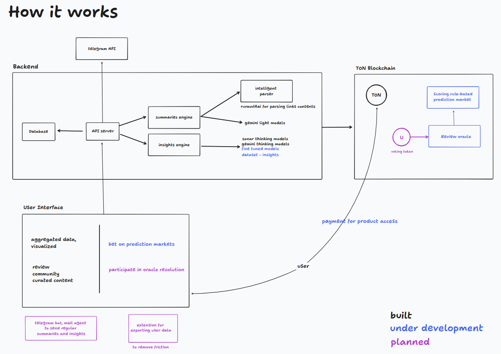

# Uniflux - Telegram Channel Intelligence Platform

A Telegram Mini App (TMA) that aggregates and summarizes updates from custom Telegram channels, providing actionable insights powered by AI and blockchain-based subscriptions.

## Overview

Uniflux transforms information overload into actionable intelligence by:
- **Aggregating** updates from multiple Telegram channels
- **Summarizing** content to eliminate redundancy 
- **Generating** actionable financial and market insights
- **Monetizing** through TON cryptocurrency subscriptions (work in progress, not live)
- **Building** a community-driven content discovery platform (work in progress, not live)



## Features

### Core Features
- **Multi-Channel Aggregation**: Collect updates from custom Telegram channels
- **AI-Powered Summarization**: Eliminate duplicate information across sources
- **Insights**: Generate insights for supporting news analysis
- **Real-time Updates**: Live data fetching and processing

### Monetization
- **TON Payments**: Subscription-based access using TON cryptocurrency

### Future Features (WIP)
- **Prediction Markets**: Bet on the most relevant messages using TON
- **Relevance Scoring**: Community-driven message importance ranking

## Tech Stack

### Backend
- **Framework**: Python Flask 
- **Database**: SQLite 
- **Telegram API**: Telethon for channel data fetching
- **AI/ML**: 
  - Gemini 2.0 Flash for content analysis
  - Sonar for financial insights
  - Crawl4AI for link parsing
- **Blockchain**: TON 


### Frontend
- **Framework**: React 

## Prerequisites

- **Python**: 3.8+ with pip
- **Node.js**: 16+ with npm
- **Telegram Account**: For API access
- **TON Wallet**: For payment testing (testnet)

## Installation & Setup

### 1. Environment Setup

```bash
# Clone the repository

# Create Python virtual environment
python3 -m venv env
source env/bin/activate  # On Windows: env\Scripts\activate

# Install Python dependencies
pip install -r requirements.txt
```

### 2. Environment Configuration

```bash
# Copy environment template
cp .env.example .env

# Edit environment variables
nano .env
```

**Required Environment Variables:**

```env
# Telegram API Configuration
TELEGRAM_API_ID=your_telegram_api_id
TELEGRAM_API_HASH=your_telegram_api_hash
TELEGRAM_BOT_TOKEN=your_bot_token

# AI Model Configuration
GEMINI_API_KEY=your_gemini_api_key
PERPLEXITY_API_KEY=your_perplexity_api_key

# Application Configuration
ENV=development
ENABLE_TELEGRAM_BOT=false
```

### 3. Database Setup and clean up

```bash
./cleanup.sh
```

### 4. Frontend Setup

```bash
# Navigate to frontend directory
cd frontend

# Install dependencies
npm install


# Return to root
cd ..
```

## Running the Application

### Development Mode

**Backend:**
```bash
# Activate virtual environment
source env/bin/activate

# Start Flask development server
flask run
```
Server runs on: `http://localhost:5000`

**Frontend:**
```bash
# In a new terminal
cd frontend

# Start React development server
npm start
```
Frontend runs on: `http://localhost:3000`

## API Endpoints

### Core Endpoints

| Endpoint | Method | Description |
|----------|--------|-------------|
| `/sources` | GET | List all configured Telegram channels |
| `/summaries` | GET | Get topic summaries for time period |
| `/insights` | POST | Generate actionable insights from summaries |
| `/feedback` | POST | Submit user feedback |
| `/subscribe` | POST | Subscribe with email |

### Parameters

**Summaries Endpoint:**
```bash
GET /summaries?period=1d&sources=channel1,channel2
```

**Insights Endpoint:**
```bash
POST /insights
Content-Type: application/json

{
  "topics": [
    {
      "topic": "DeFi Protocol Launch",
      "summary": "New lending protocol announced...",
      "message_ids": [1, 2, 3],
      "importance": 8
    }
  ]
}
```
